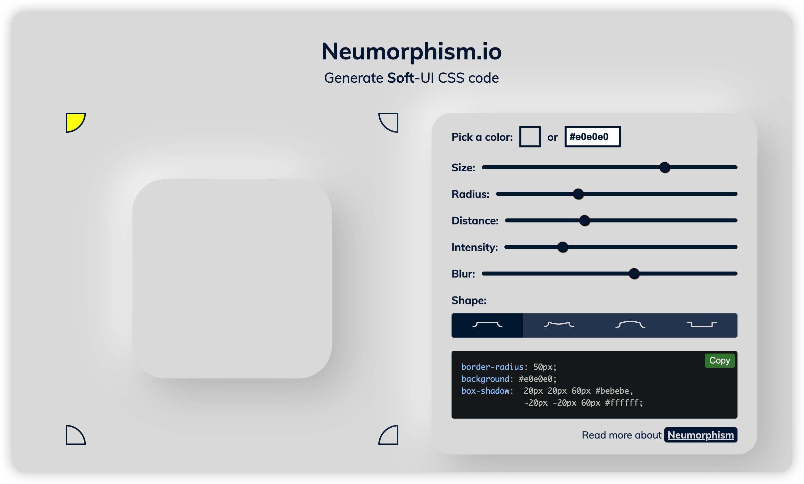

# 优质、常用网站
## grid布局生成

::: info 介绍
可以在线生成grid布局的网站，非常适合新手学习，同时他也是一个开源网站

`官网:` https://cssgrid-generator.netlify.app/

`开源地址:` https://github.com/sdras/cssgridgenerator

:::

## 时间戳

::: info 介绍
非常好用的时间戳在线工具

`地址:` https://tool.lu/timestamp/

:::

## postMan

::: info 介绍
在线postMan

`地址:` https://hoppscotch.io/cn/

:::

## css生成网站

::: info 介绍
常用的css生成网站

`按钮生成:` https://neumorphism.io/#e0e0e0

:::
