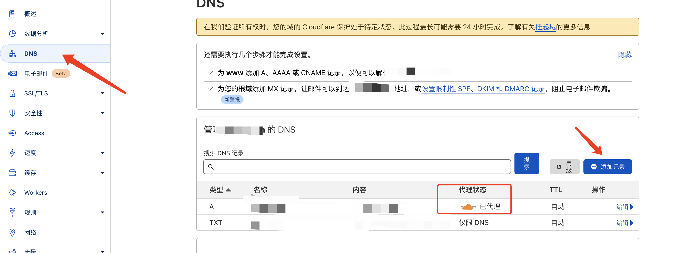
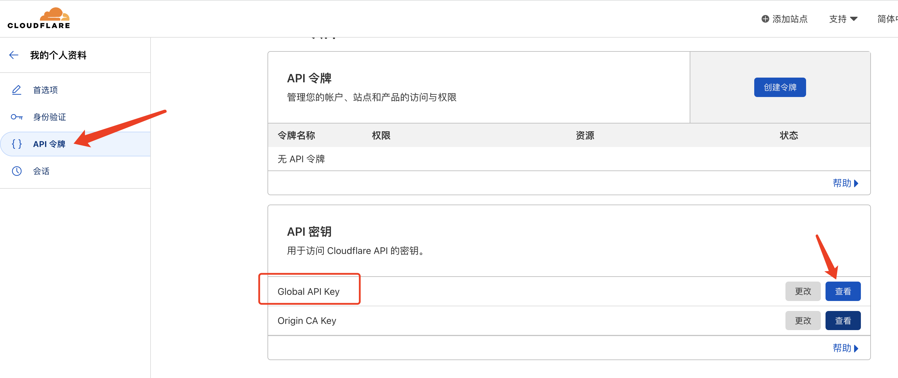

# 开发日记

## (2022.9.15）利用GitHub Actions自动编译发布我的博客
这天懵生了用Github Page来搭建一个类博客，记录日常开发的想法，于是有了以下脑路对话
- Github Page怎么用，百度了一番，嗯，原来README就可以默认展示为网页
- 那我要放html网页怎么办，哦 ，原来他是支持的，和普通网页目录结构一样
- 那我要用什么框架来开发这个博客，嗯，vuePress是一个不错的选择
- 于是，创建项目，开发，编译，上传代码，完成
- 。。。这样好麻烦呀，我能不能只上传代码，然后让他自动完成
- 当然可以，利用GitHub Actions就行
- 于是。。。

### 起步：
你都能看见这篇文章，想必你对github，git命令应该有所了解了
你需要了解github page[参考教程](https://sspai.com/post/54608)
其次最主要的就是GitHub Actions了

### 正文：
#### 基本
GitHub Actions其实就一个工作流，使用yml(yaml)配置文件来驱动。配置文件必须存放在代码仓库的.github/workflows目录中。GitHub 只要发现.github/workflows目录里面有.yml(yaml)文件，就会自动运行该文件。

#### 实战
其余步骤都很简单，可以参考此文章
参考地址： https://blog.csdn.net/qq_31755699/article/details/123904767

下面主要讲解一下配置文件（⚠️核心）
``` yaml
name: Build and Deploy #这个名字无所谓
on: 
  push:
    branches:
      - main # 你要拉取的分支名字
jobs:
  build-and-deploy:
    runs-on: ubuntu-latest # 在什么上工作，ubuntu的最新系统上
    steps:
      - name: Checkout 🛎️ # 他只是个名字
        uses: actions/checkout@v3 # 用于处理仓库的，例如拉去代码，提交代码一类的操作https://github.com/actions/checkout
        with:
          persist-credentials: false # 表示操作结束否是否删除token，false为不删除，直接退出

      - name: Install and Build 🔧 # 使用npm来进行构建项目，也就是编译。
        run: | # yarn为安装依赖，也可以写作npm install，yarn build为打包，具体命令参考你的package.json只的命令
          yarn
          yarn build

      - name: Deploy 🚀
        uses: JamesIves/github-pages-deploy-action@releases/v3 #第三方的构建工具,可以理解为上传代码的工具
        with:
          GITHUB_TOKEN: ${{ secrets.ACCESS_TOKEN }} # 获取你的私钥，注意ACCESS_TOKEN名字同你存放密钥的名字
          branch: build-page # 要上传的分支
          folder: dist # 你要传的目录

```
演示地址：[ckcoding.github.io](https://ckcoding.github.io)

## (2022.9.20）利用公网ipv6实现远程访问
先记录几个ipv6的检测地址

[强烈推荐:https://ipw.cn/ipv6/](https://ipw.cn/ipv6/)

[https://www.test-ipv6.com/](https://www.test-ipv6.com/)

常用命令
```bash
# 请勿用于商业用途，仅供个人测试学习之用，请遵守中国法律法规
# 查询本机外网IPv4地址
curl 4.ipw.cn

# 查询本机外网IPv6地址
curl 6.ipw.cn

# 测试网络是IPv4还是IPv6访问优先(访问IPv4/IPv6双栈站点，如果返回IPv6地址，则IPv6访问优先)
curl test.ipw.cn
```
小知识：`ipv4的网络无法直接访问ipv6，所以，在域名解析的地方也要解析A记录`
### ikuai管理平台远程访问

目前我的需求是这样的，我需要在公司访问家里的网络。家里是IPV6的环境，而公司不支持IPV6，有什么办法能够在纯IPV4的环境下访问纯IPV6的服务呢，而且不限速，还免费呢？

答案：就是利用Cloudflare，将IPV6转为IPV4

[Cloudflare：点击访问](https://dash.cloudflare.com/bc25671c4b2c14dab6efbfadb2d548ca)

准备：`域名`（推荐阿里云的），`Cloudflare`账号

起步：

- 登录Cloudflare添加你的域名，并选择免费计划


- 然后修改域名的DNS服务商为`Cloudflare`给你生成的
- 阿里云修改DNS服务商方法：[点击访问](https://help.aliyun.com/document_detail/54157.html?spm=a2c4g.11186623.0.0.d8805ec1DE8cHW)

- 修改完毕后，需要一段时间进行解析`Cloudflare`会自动检测，一般几分钟就成功了
- 然后手动添加一条DNS记录如下图。记得开启这个已代理，图标为黄色即为开启
  


- 然后获取`Cloudflare`的api密钥，如下图(注意⚠️，ikuai必须使用全局的密钥)



- 最后等待几个小时后即可在ipv4环境下访问ipv6